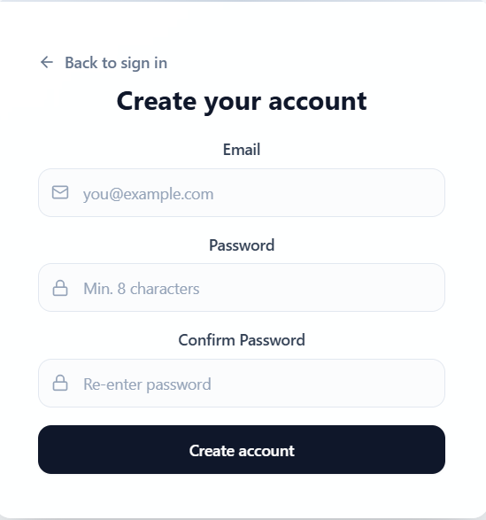
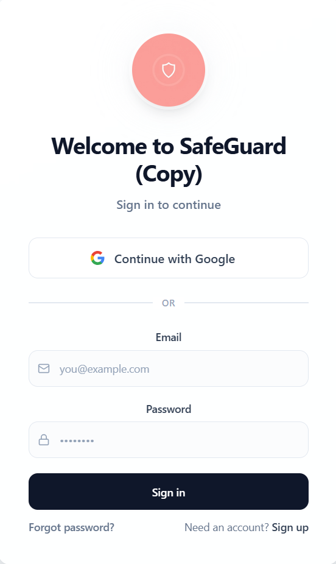
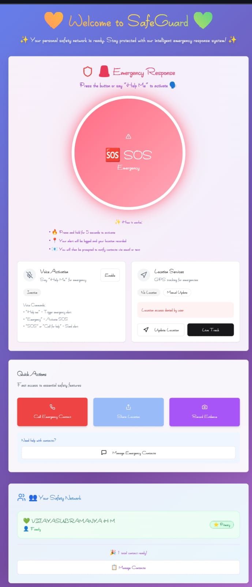
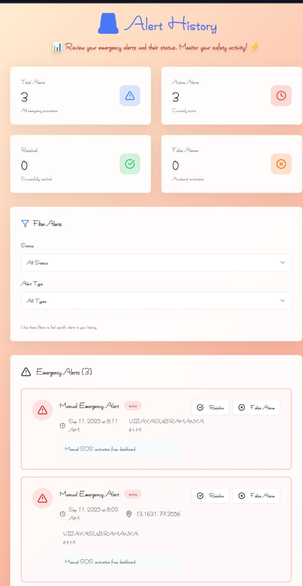
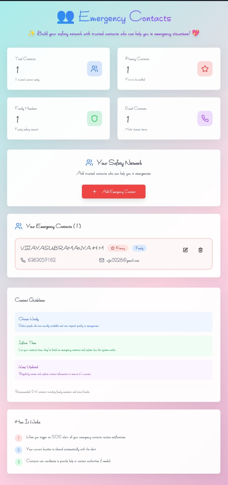
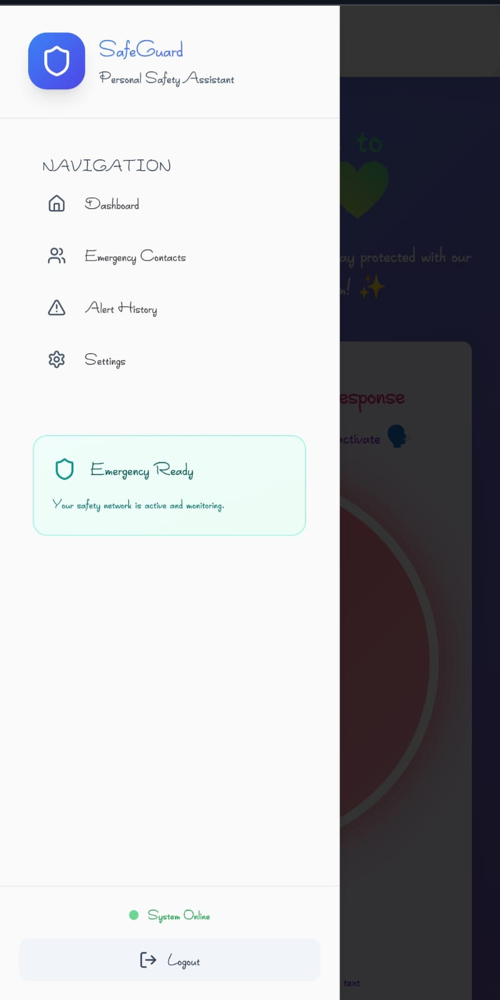

# 🛡️ Safe Guard – Women Safety Web App

## 📌 Description
Safe Guard is a full-stack web application designed to enhance women safety using real-time tracking and emergency alert features.

## 🚀 Features
- 📍 Real-time location tracking using Google Maps API
- 🎤 Voice-activated SOS using Web Speech API
- 🚨 Emergency alert system for quick response
- 📱 Responsive and user-friendly interface

## 🛠 Tech Stack
- React.js
- JavaScript
- Python
- Google Maps API
- Web Speech API

## 📷 Screenshots

## 🔒 Note
Source code is private. Available upon request.
